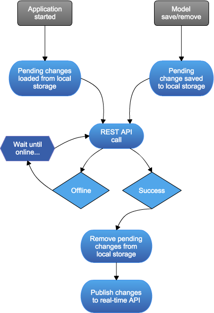

#  Rekord

Rekord is a javascript REST ORM that is offline and real-time capable.

**Features**
- Relationships `hasOne`, `belongsTo`, `hasMany`, `hasManyThrough`, & `hasRemote`
- Polymorphic relationships for `hasOne`, `belongsTo` & `hasMany`
- Validation (59 rules, 6 expressions, 13 transforms, and custom functions) through [rekord-validation](https://github.com/Rekord/rekord-validation)
- Migrations through [rekord-migrations](https://github.com/Rekord/rekord-migrations)
- Batch REST execution for any/all types and operations
- Inheritance (with `extend` option)
- Horizontal scaling with `shard`ing
- Supports composite keys
- Specify default values
- Handle collisions with a "revision" field
- Automatically refresh when application becomes online
- Cache no data, all data, or only pending changes
- Send only changed values to REST/real-time APIs or entire object
- Convert values between client & server data types
- Easily order by field, combination of fields, custom function, or expression
- Control what information from relationships (if any) is stored locally or sent to the REST api
- Add dynamic fields to model objects (setting & getting)
- Data returned from REST calls or real-time events is intelligibly merged to avoid overwriting local unsaved changes
- Add `updated_at` and `created_at` timestamps and their automatic behavior with a single option
- Configurable date/timestamp transformations
- Add custom methods to the model objects
- Load bootstrapped data with `model.boot( model or array of models )`
- Execute searches (fields are sent to REST API and an array of models is expected) with `model.search( URL, [options], [post data], [run now?] )`
- Execute paginated searches
- Add global event listeners to the "database" or all model instances
- Stores data locally through `Rekord.store` interface (ex: [storkjs](https://github.com/Rekord/rekord-storkjs))
- Stores data remotely through `Rekord.rest` interface (ex: [angular](https://github.com/Rekord/rekord-angular), [jquery](https://github.com/Rekord/rekord-jquery), [pouchdb](https://github.com/Rekord/rekord-pouchdb), [firebase](https://github.com/Rekord/rekord-firebase))
- Real-time changes through `Rekord.live` interface (ex: [pubsub](https://github.com/Rekord/rekord-pubsub), [pouchdb](https://github.com/Rekord/rekord-pouchdb), [firebase](https://github.com/Rekord/rekord-firebase))
- Create a live filtered view of any collection
- Create a live paginated view of any collection
- All collections have the following notable operations: sort, page, filtered, where, subtract, intersect, complement, clear, removeWhere, min, max, first, last, sum, avg, count, pluck, reduce, random, chunk, reverse, & group
- Model collections have the following notable operations: removeWhere, update, updateWhere, & saveWhere

**FAQ**

1. *Does Rekord directly interact with a database?*  
No, of course not. It interacts with a REST API.

2. *Why do I need to use Rekord?*  
Working with relational data in javascript can be painful. Rekord eases that pain by allowing you to use plain looking objects that can have any type of relationship with other objects. Rekord takes into consideration things like foreign keys - where you need object A successfully remotely saved before you can save object B. These types of constraints are ugly and bothersome to handle yourself and easily result in bugs. If you're familiar with server-side ORMs, then Rekord should be really easy to pick up. You'll find all the same features and even more!

3. *How are ID collisions avoided?*  
The key for a model can be given when creating a model - otherwise the key will be given a UUID. This is necessary to be offline capable, models need keys so related models can reference it.

4. *What do you mean by capable?*  
Caching data/changes locally and real-time behavior is optional - if you don't want either feature then you don't need to include an implementation.

5. *Rekord can handle horizontal scaling via sharding?*  
Yes! You can say models of type X can exist on REST endpoints A, B, & C. You can provide a function which takes a model and returns the set of REST endpoints that need to be sent saves/removes. When you query on a sharded type it can contact all REST endpoints and combine the results.

6. *Why do some functions in the API start with $?*  
The `Rekord.Model` and `Rekord.Search` classes can have custom properties therefore to avoid collisions the functions and private variables start with `$`. If your design includes properties like `status`, `operation`, `db`, `relations`, etc it won't interfere with Rekord.

**Installation**

The easiest way to install rekord is through bower via `bower install rekord`.

- `rekord.js` is `376KB` (`66KB` gzipped)
- `rekord.min.js` is `110KB` (`28KB` gzipped)

**Examples**

Examples exist in a separate project: https://github.com/Rekord/rekord-examples

**Bindings**

Bindings are used to implement core pieces of functionality in rekord - these interfaces allows any library to work with rekord.

- [Angular](https://github.com/Rekord/rekord-angular) - implements `Rekord.rest` and adds `Rekord.Bind`
- [React](https://github.com/Rekord/rekord-react) - adds `Rekord.Bind`
- [StorkJS](https://github.com/Rekord/rekord-storkjs) - implements `Rekord.store`
- [PubSub](https://github.com/Rekord/rekord-pubsub) - implements `Rekord.live`
- [Firebase](https://github.com/Rekord/rekord-firebase) - implements `Rekord.store`, `Rekord.rest`, & `Rekord.live`
- [PouchDB](https://github.com/Rekord/rekord-pouchdb) - implements `Rekord.store`, `Rekord.rest`, & `Rekord.live`
- [jQuery](https://github.com/Rekord/rekord-jquery) - implements `Rekord.rest`
- [Debugging](https://github.com/Rekord/rekord-debug) - implements `Rekord.debug`

**Add-Ons**

Add-Ons add new functionality to Rekord.

- [Validation](https://github.com/Rekord/rekord-validation) - adds `validation` option
- [Migrations](https://github.com/Rekord/rekord-migrations) - adds `Rekord.migration` function

**Rekord's Life Cycle:**

**Documentation**

The main documentation is located [here](http://rekord.github.io/rekord/docs/). Additional documentation can be found here:

- [Examples](docs/Examples.md)
- [Rekord options](docs/Rekord-Options.md)
- [hasOne options](docs/HasOne-Options.md)
